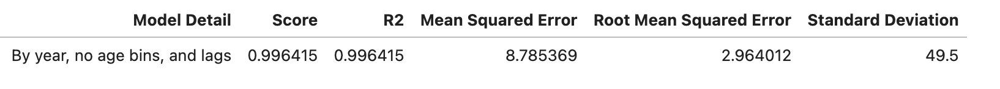
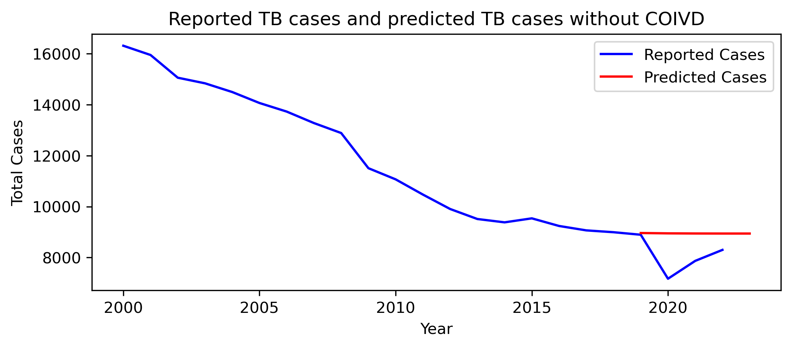
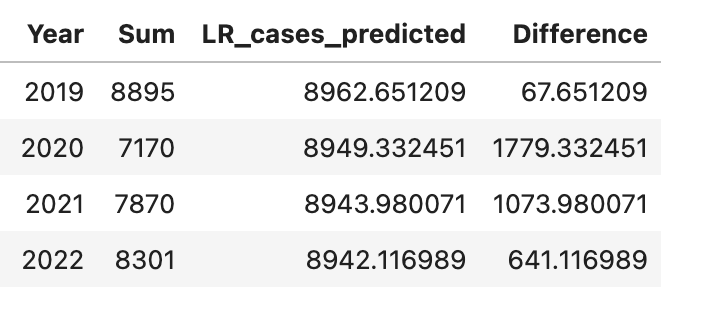

# tbUS

Exploring tuberculosis trends in the U.S. over the years through machine learning.

## Project Details

- **Project 4** 
- **Columbia School of Engineering Data Analytics Bootcamp**
- **Authors:** Daniel Kenet, Jennifer Kim, Kat McEldowney, Michelle Minkowitz (Team Uber Colossal)
- **Date:** April 22, 2024

###  Introduction

Tuberculosis (TB) is an airborne infectious disease caused by *Mycobacterium tuberculosis*. Despite advancements in treatment and prevention programs, TB remains a serious global concern. This is particularly challenging in developing countries with limited laboratory facilities. According to the World Health Organization, about [1.5 million people](https://www.who.int/health-topics/tuberculosis#tab=tab_1) die from the disease every year, making TB the world’s top infectious killer.

In the United States specifically, the Centers for Disease Control and Prevention (CDC) started a national surveillancce system for TB cases in 1953. The introduction of antimicrobial therapy led to a decrease in the incidence rate from 53 to 9.3 cases per 100,000 persons between 1953 and 1985. However, in the late 1980s, the rate increased, reaching a peak of 10.5 cases per 100,000 persons in 1992, which correlated with the onset of the acquired immunodeficiency syndrome (AIDS) epidemic. 

When concerns about AIDS and TB were recognized in the early 1990s, the government increased federal funding and implemented stronger TB control efforts. Due to these interventions, the rate went down to 5.8 per 100,000 persons in 2000. The rate had reached a steady level at about 3.0 per 100,000 persons from 2013 up until 2019.

Due to the Novel Coronavirus that began to spread in the U.S. at the beginning of 2020, clinics and healthcare facilities had to shut down and steer their resources to COVID. The disruptions in healthcare services, coupled with delayed diagnosis and reduced access to care due to lockdown measures, have contributed to the challenges faced in TB control during the COVID-19 pandemic ([Falzon et al. 2023](https://www.ncbi.nlm.nih.gov/pmc/articles/PMC10546619/)).

There was a significant drop in TB cases reported ([20.1% change in rate](https://www.cdc.gov/tb/statistics/surv/surv2022/images/Slide4.PNG)) from 2019 to 2020. Following this sharp decline, TB cases rose in 2021 and 2022, but remain lower compared with 2019. At present, TB cases appear to be returning to pre-pandemic levels. However, the pandemic's impact on TB control has yet to be thoroughly explored.

We wanted to gauge the effect of COVID on TB by using supervised machine learning. To achieve this endeavor, we developed a time-series linear regression model that is trained on TB surveillance data before 2019 and predicts the number of TB cases onwards if COVID had not interrupted TB services.

###  Methods

####  Objective
The main aim of this project was to develop and select the most optimal model that predicts the number of TB cases and rates following 2019 if COVID had not happened. 

####  Data
We analyzed tuberculosis surveillance data from 2000-2022 provided by the CDC.

The original data consisted of TB cases and rates by year, state, sex, whether the patient was born in or outside the U.S., and race/ethnicity were downloaded as CSV files from the CDC's surveillance data portal called [AtlasPlus](https://www.cdc.gov/nchhstp/atlas/index.htm). We cleaned and consolidated the CSV tables into Pandas DataFrames in a Jupyter Notebook (see full code in `Dataframe_Merging.ipynb`).

We also mapped the TB cases and rates by year and state in JavaScript--please visit our [webpage](https://henniferkay.github.io/tbUS/) to explore the U.S. TB surveillance data.

####  Definitions
According to the CDC, a tuberculosis case is counted as a Confirmed Case if the patient meets the clinical case definition (as determined by a medical provider) or is laboratory confirmed (positive for TB on culture or Nucleic Acid Amplification Test). 

A TB case is not to be confused with a latent TB infection (LTBI) case. A person with LTBI breathed in TB bacteria and became infected at one point but has not turned into active TB disease and is not symptomatic or infectious.

Rate is defined as the number of the event (TB cases) per 100,000 persons.

####  Modeling
We tried fitting a couple of different ML models to compare the TB trends with and without COVID. Regardless of the model type, we were interested in predicting TB cases (dependent or Y variable) over the years (predictor or X variable).

We attempted fitting a neural network model, which resulted in huge loss and low accuracy values (0%): our deep learning process is documented in `tb_us_nn_model.ipynb`.

We decided that time series forecasting was the best approach to modeling the TB case data. Time series forecasting predicts the future values based on trends learned from the historical data. We trained a linear regression model on the TB case data from 2000-2018 and made it predict the case counts for the following years from 2019-2022. We added lags to the data set to auto-corrolate the each years data with the two previous years. This allowed us to better model each years number of reported cases with the previous years data and improve the accuracy of the forecastsing. We applied the model to data sets with two years of lags and without for comparison.

Different combinations of linear regression models were fitted and compared based on performance metrics including R-squared, Mean Squared Error (MSE), Root Mean Squared Error (RMSE), and standard deviation.

We provided full code and model selection process in `linear_reg_cases.ipynb`.

###  Results
We found that splitting the TB case data into testing and training sets and accounting for time lags produced the most optimal model (smallest MSE). Our final model is provided below:

The graph below shows the actual TB trends in blue while the predicted values are represented by a red line--there's a noticeable gap between predicted and actual numbers of TB cases. 

Our model suggested that if the COVID pandemic had not caused disruptions in TB management and care, over 1,000 more TB cases would have been reported, and the case counts per year would have been at a steady level around 8,900. The following table shows the predicted TB case counts and the differences between the predicted and actual reported values.

###  Limitations and Future Directions
This is an ecological study analyzing TB cases at the state level, rather than focusing on individual TB patients. The ecological study design may limit the generalizability of our findings to individual-level associations and specific demographic or clinical factors that could influence TB outcomes.

We did not add explanatory variables to our model because we could not find appropriate data by state and year on risk factors for TB (e.g. migration rate, prior TB or latent infection population size). Therefore, we were only able to perform a univariate time series analysis that looks at the states' overall TB cases over the years. While this limitation is important to note, it underscores the need for further research to explore the potential implications for TB control efforts.

To deepen our understanding of the impacts of COVID on TB, it would be worthwhile looking at the disease synergy between TB and COVID. Previous studies have alluded that COVID patients with prior or concurrent TB are more likely to die in high TB burden settings. Analyzing more granular data collected from individual TB patients and their clinical outcomes is warranted. Additionally, expanding our analysis to other countries could provide valuable insights into how the pandemic's impacts vary between high and low TB burden areas.

### Conclusion
Even though this analysis carries limitations and provides an alternative snapshot of COVID's impacts on TB in the U.S., our model sheds light on public health ramifications of the pandemic.

Timing is crucial in TB care--delayed diagnosis and treatment could further complicate the patient's disease status and overall health. If a significant portion of TB cases missed timely diagnosis and care due to impaired access to medical services, people might have undiagnosed or untreated TB longer than they should have been, increasing the pool of infectious individuals in the community.

Our findings underscore the need for ongoing monitoring and research to understand the long-term effects of the COVID-19 pandemic on TB and other infectious diseases. 

Additionally, future studies should explore the disease synergy between TB and COVID-19, considering more granular data collected from individual TB patients and their clinical outcomes. This will help inform public health policies and preparedness efforts to ensure a more rapid and effective response to TB and other major diseases in future pandemics.